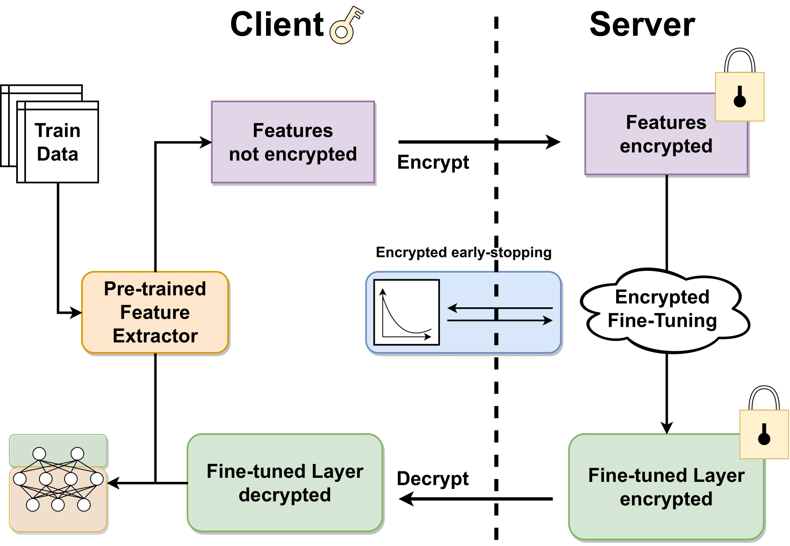

# HETAL: Efficient Privacy-preserving Transfer Learning with Homomorphic Encryption



Official repository for **HETAL: Efficient Privacy-preserving Transfer Learning with Homomorphic Encryption (ICML'23 Oral)** by [Seewoo Lee](https://seewoo5.github.io/)<sup>1*</sup>, Garam Lee<sup>2</sup>, [Jung Woo Kim](https://www.linkedin.com/in/jung-woo-kim-9a522469/)<sup>2</sup>, [Junbum Shin](https://www.linkedin.com/in/junbum-shin-8bb3a3247/)<sup>2</sup>, and [Mun-Kyu Lee](http://ucs.inha.ac.kr/)<sup>3**</sup>.

<sup>1</sup>University of California, Berkeley <sup>2</sup>[CryptoLab](https://www.cryptolab.co.kr/en/home/) <sup>3</sup>Inha University

\* Work done at CryptoLab

** Corresponding author

You can read the paper here: [PMLR Link](https://proceedings.mlr.press/v202/lee23m.html)

For the updates after publication, see arXiv version: [arXiv Link](https://arxiv.org/abs/2403.14111)

**This repository uses CPU version of HEaaN library. To use GPU acceleration, please contact stat@cryptolab.co.kr.**


## Installation

### Requirements

* OS: Linux
* Python: 3.8
* Recommended Memory: 32GB (Minimum : 16GB)

First install [pipenv](https://pipenv.pypa.io/en/latest/). Then run the following shell commands.
All the required packages including `heaan` and `heaan_sdk` will be installed using existing `whl` files (`heaan_sdk-0.2.0-cp38-cp38-linux_x86_64.whl` and `heaan-0.1.0+cpu-cp38-cp38-linux_x86_64.whl`).
```
pipenv --python 3.8
pipenv shell
pipenv install
```

## How to use

See `README.md` files in `src/hetal` and `src/benchmark` directories for guides.


## Citation

Use the following Bibtex entry for citation.
```
@article{lee2023hetal,
  title={HETAL: Efficient Privacy-preserving Transfer Learning with Homomorphic Encryption},
  author={Lee, Seewoo and Lee, Garam and Kim, Jung Woo and Shin, Junbum and Lee, Mun-Kyu},
  journal={ICML},
  year={2023}
}
```

## License

This is available for the non-commercial purpose only. See `LICENSE` for details.


## AutoFHE

HETAL is now integrated into CryptoLab's new product, **AutoFHE**. It is available in [autofhe.com](https://autofhe.com/).
